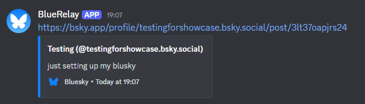

A simple self-hosted Discord bot that notifies you of new BlueSky posts from a user of choice



# Usage

### [Create your bot](https://discord.com/developers/applications) and [install node.js](https://nodejs.org/en)

Make sure the following variables are assigned their appropriate values:

```js
const token = '12345ABCDF' // DO NOT SHARE

let channelID = '123456789' // Channel you want to redirect posts to
let username = 'example.bsky.social' // BlueSky handle's name, not display name
let intervalSeconds = 120 // How often to check in seconds
```

Install discord.js by running `npm install discord.js` from the terminal in the Blue Relay directory
At which point just start the application by running `node main.js` 